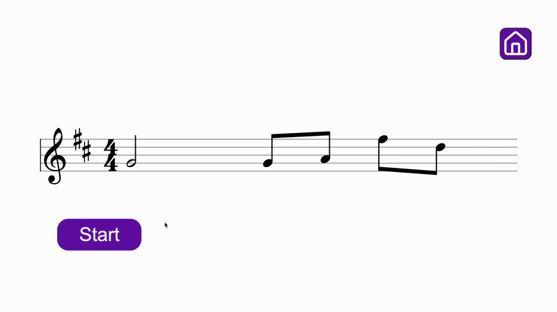

# sightread.me 🎵  
**Live demo:** https://sightread.me

A web app that helps musicians improve sight‑reading with **real‑time pitch detection**, **metronome guidance**, and **adaptive exercises**. Built with React, TypeScript, and Vite.

---

## ✨ Features
- 🎼 **Interactive sight‑reading** rendered with VexFlow  
- 🎤 **Real‑time pitch feedback** (Pitchy)  
- ⏱️ **Metronome** with adjustable tempo  
- 🎮 **Custom difficulty modes** and rule‑based melody generation  
- ⚡ **Snappy UI** using React Query & modern hooks  

## 🧱 Tech Stack
**Frontend:** React + TypeScript + Vite  
**Libraries:** VexFlow, Pitchy, Sonner, TanStack Query, React Router, lucide‑react

## 🧠 Backend (FastAPI)
sightread.me uses a lightweight FastAPI backend that generates playable melodies 
and serves them as JSON to the React frontend.

For simplicity, the backend source code is not included in this public repository.  
If you'd like to learn more about the API design or generation logic, feel free to reach out.

## 📝 Repository Notes
This repository contains the **source code** (`/src`) for the app.
- Music rendering: `SheetMusicDisplay.tsx`
- Pitch analysis: `useAudio.ts`  
- Game logic: `SightReading.tsx`, `useScroll.ts` 
- Metronome logic: `Metronome_2.tsx`

## 📄 License
MIT
